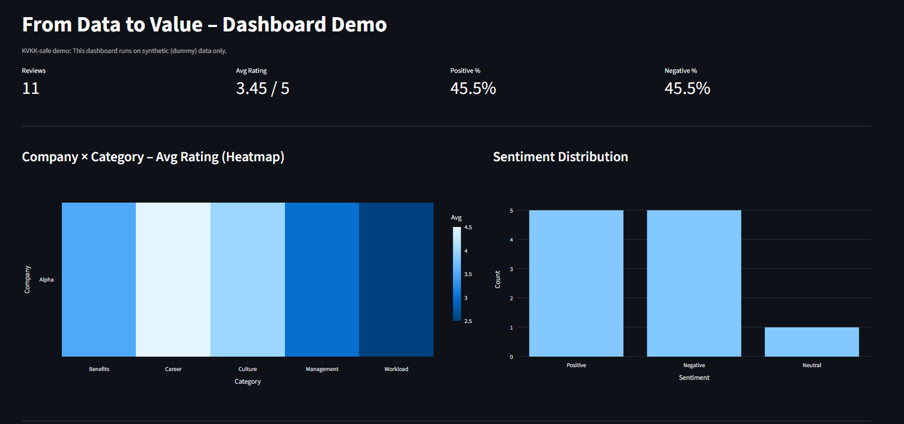

# From Data to Value – Dashboard Demo

This repository demonstrates how company feedback and reviews can be transformed into **actionable business insights** using data analytics and visualization.

The project is designed as a **privacy-safe demo** and runs entirely on **synthetic (dummy) data**.  
No real company, employee, or user data is used.

---
## 🎯 Project Purpose

The goal of this project is to showcase:

- How qualitative feedback (reviews) can be structured and analyzed
- How sentiment analysis supports decision-making
- How dashboards help companies and stakeholders move from **raw data → insights → value**

This demo reflects real-world use cases inspired by platforms such as:
**Glassdoor, LinkedIn, and company feedback systems**, while remaining fully privacy-safe.

---

## 🧩 Key Features

- 📊 **Interactive Dashboard (Streamlit)**
- ⭐ **Company × Category Average Rating Heatmap**
- 😊😐😞 **Sentiment Distribution Analysis**
- 📈 KPI Cards:
  - Total reviews
  - Average rating
  - Positive / Negative sentiment ratio
- 🔍 Company & category-level filtering

---

## 🧠 Analytics Concepts Demonstrated

- Rating aggregation (1–5 scale)
- Category-based performance comparison
- Sentiment labeling (Positive / Neutral / Negative)
- Insight-driven dashboard design
- Privacy-aware analytics development

---

## 🔐 Data & Privacy Notice

This project uses **synthetic (dummy) data only**.

- No real company names
- No real employee reviews
- No personal or sensitive information

The dataset is artificially generated to simulate realistic analytics scenarios while ensuring full privacy compliance.

---

## 🛠 Tech Stack

- **Python**
- **Pandas**
- **Streamlit**
- **Plotly**
- (Optional) SQL-compatible design for real-world adaptation

---

## 🚀 How to Run Locally

pip install -r requirements.txt
streamlit run app.py

---

## 📌 Use Case Examples

This demo illustrates how such dashboards could support:

Companies monitoring employee experience trends

HR teams identifying strengths and risk areas

Data analysts translating feedback into insights

Product teams validating analytics concepts safely

---

## 👋 About Me

I am a data analyst in transition, building hands-on projects that connect
analytics, storytelling, and real business value.

This repository is part of my learning and portfolio journey.

📬 Feel free to explore, fork, or reach out.

